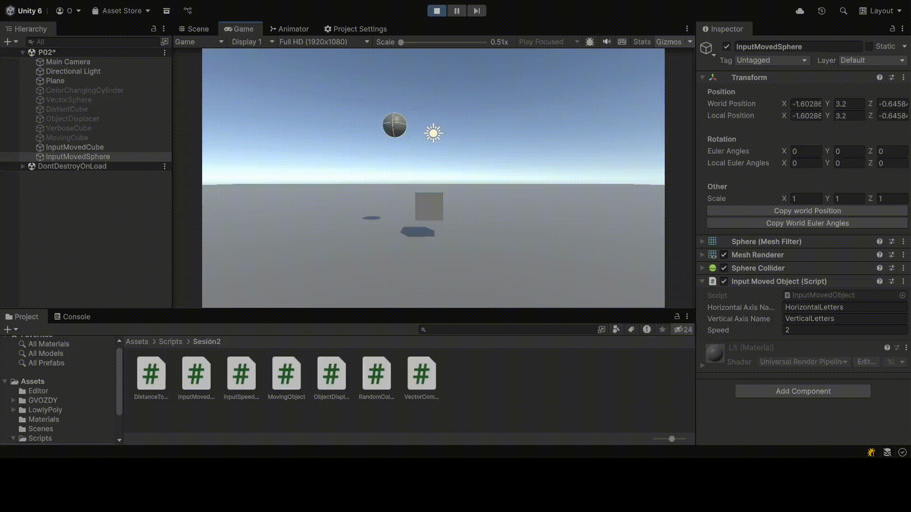

# InterfacesInteligentes-P02

En la segunda práctica de la asignatura se han realizado distintos ejercicios para la familiarización con Unity y los Scripts de C#

1. Crea un script asociado a un objeto en la escena que inicialice un vector de 3 posiciones con valores entre 0.0 y 1.0, para tomarlo como un vector de color (Color). Cada 120 frames se debe cambiar el valor de una posición aleatoria y asignar el nuevo color al objeto. Parametrizar la cantidad de frames de espera para poderlo cambiar desde el inspector. 

2. Crea un script asociado a la esfera con dos variables Vector3 públicas. Dale valor a cada componente de los vectores desde el inspector. Muestra en la consola:
La magnitud de cada uno de ellos. 
El ángulo que forman
La distancia entre ambos.
Un mensaje indicando qué vector está a una altura mayor.

3. Muestra en pantalla el vector con la posición de la esfera

4. Crea un script para la esfera que muestre en consola la distancia a la que están el cubo y el cilindro.

5. Selecciona tres posiciones en tu escena a través de un objeto invisible (marcador) que incluya 3 vectores numéricos para configurar posiciones en las que quieres ubicar los objetos en respuesta a pulsar la barra espaciadora. Estos vectores representan un desplazamiento respecto a la posición original de cada objeto. Crea un script que ubique en las posiciones configuradas cuando el usuario pulse la barra espaciadora. 

6. Agrega un campo velocidad a un cubo y asígnale un valor que se pueda cambiar en el inspector de objetos. Muestra la consola el resultado de multiplicar la velocidad por el valor del eje vertical y por el valor del eje horizontal cada vez que se pulsan las teclas flecha arriba-abajo ó flecha izquierda-derecha. El mensaje debe comenzar por el nombre de la flecha pulsada. 

7. Mapea la tecla H a la función disparo

8. Crea un script asociado al cubo que en cada iteración traslade al cubo una cantidad proporcional un vector que indica la dirección del movimiento: moveDirection que debe poder modificarse en el inspector.  La velocidad a la que se produce el movimiento también se especifica en el inspector, con la propiedad speed. Inicialmente la velocidad debe ser mayor que 1 y el cubo estar en una posición y=0. En el informe de la práctica comenta los resultados que obtienes en cada una de las siguientes situaciones:
    - **a. duplicas las coordenadas de la dirección del movimiento:**
                 - El objeto se mueve el doble de rápido en la misma dirección
    - **b. duplicas la velocidad manteniendo la dirección del movimiento:**
                 - El objeto se mueve el doble de rápido en la misma dirección
    - **c. la velocidad que usas es menor que 1:**
                 - El cubo se mueve más lentamente
    - **d. la posición del cubo tiene y>0:**
                 - Nada distinto ocurre
    - **e. intercambiar movimiento relativo al sistema de referencia local y el mundial:**
                 - Se mueve según se haya rotado el cubo

9. Mueve el cubo con las teclas de flecha arriba-abajo, izquierda-derecha a la velocidad speed. Cada uno de estos ejes implican desplazamientos en el eje vertical y horizontal respectivamente. Mueve la esfera con las teclas w-s (movimiento vertical) a-d (movimiento horizontal).

10. Adapta el movimiento en el ejercicio 9 para que sea proporcional al tiempo transcurrido durante la generación del frame.

11. Adapta el movimiento en el ejercicio 10 para que el cubo se mueva hacia la posición de la esfera. Debes considerar que el avance no debe estar influenciado por cuánto de lejos o cerca estén los dos objetos. 

12. Adapta el movimiento en el ejercicio 11 de forma que el cubo avance mirando siempre hacia la esfera, independientemente de la orientación de su sistema de referencia. Para ello, el cubo debe girar de forma que el eje Z positivo apunte hacia la esfera . Realiza pruebas cambiando la posición de la esfera mediante las teclas awsd

13. Utilizar el eje “Horizontal” para girar el objetivo y que avance siempre en la dirección hacia adelante.
